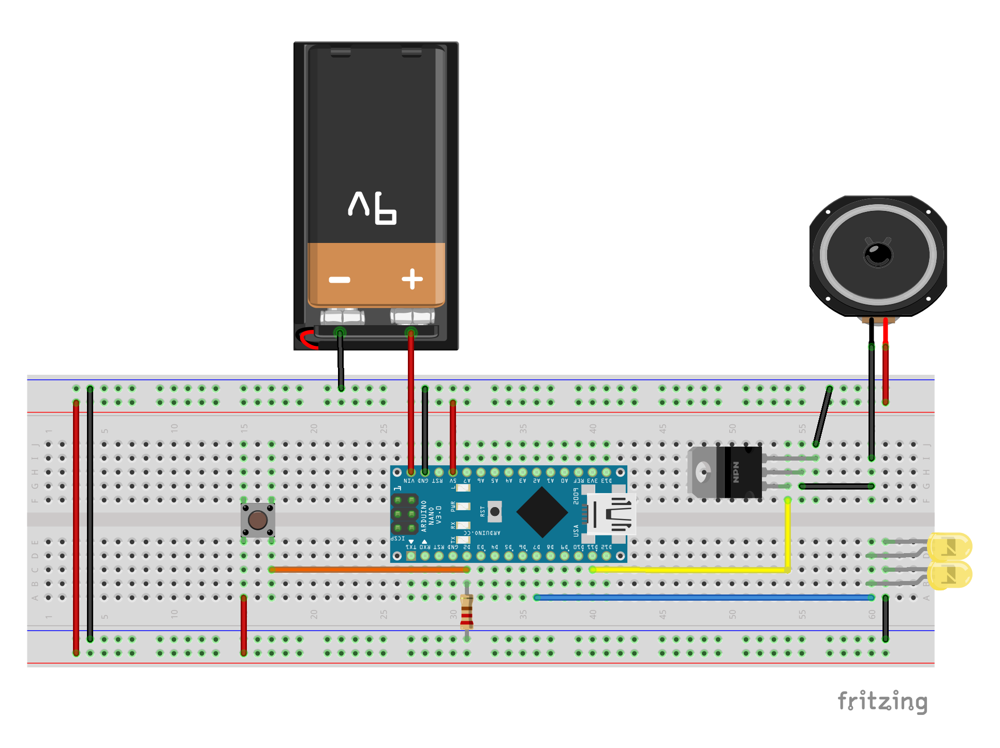

# Chest de Zelda, C'est Sérieux!!

Voici le fruit de la collaboraboration entre Sophie Déziel et Le Jeu C'est Sérieux: un coffre de Zelda qui active son et lumières à son ouverture! Vous aussi vous pouvez en fabriquer un!

## Liste du matériel

- Arduino Nano
- Haut-Parleur 8 Ohms
- Transistor TIP31c (peut être remplacé par de nombreux autres types de transistors)
- Microswitch "Normaly Closed"
- 2 LED de la couleur de votre choix
- Résistances ( valeurs à vérifier)
- Pile 9v ainsi que son connecteur

## Schéma de branchement

